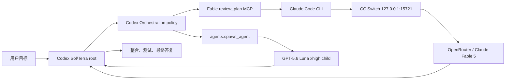

# Mac 与 Windows 配置、故障排查和 FAQ

本文记录本 fork 在 Mac mini 和 Windows 上接通 Codex、Claude Code、CC Switch/OpenRouter、Claude Fable 5 和 Luna executor 时实际遇到的问题。

日常工作流见 [Codex Orchestration 中文使用手册](usage.md)。

## 一、先分清四方职责

| 组件 | 负责什么 | 不负责什么 | 主要真相来源 |
|---|---|---|---|
| Codex Orchestration | 写入路由策略、提供 Fable MCP bridge、指导 root 使用 advisor/executor | 不创建第二个 orchestrator，不保管 OpenRouter key | plugin list、`config.toml`、routing state、status |
| Codex | 运行 root，调用 Fable 工具，创建 Luna child，整合和验收 | 不替 CC Switch 配 provider，不把 Fable 当 Codex 原生模型 | task JSONL、child session、Codex 日志 |
| Claude Code | 按插件固定参数调用 `claude-fable-5`，返回结构化审查 | 不负责 Luna，不负责 Codex 子任务调度 | `claude --version`、Claude 设置、CLI 输出 |
| CC Switch | 在本机 `127.0.0.1:15721` 提供 Claude → OpenRouter 转发和模型映射 | 不负责 Codex `agents.spawn_agent` | health、当前 provider/mapping、request logs、`cc-switch.db` |

OpenRouter 是 CC Switch 后面的上游 provider，不是第五个本地调度器。



定位问题时先判断故障属于哪一段，不要同时修改四方配置。

## 二、已经解决的问题清单

| 问题 | 表现 | 根因 | 解决结果 |
|---|---|---|---|
| 原插件只假定 Claude 第一方订阅 | 当前 Claude Code 走 OpenRouter，Fable setup 不匹配 | transport 假设与实际环境不同 | 增加显式 `cc-switch-openrouter-loopback` 路线 |
| Provider 凭据边界 | 担心把 OpenRouter key 写进 Codex | 跨组件集成容易错误复制凭据 | bridge 只使用现有 Claude/CC Switch 用户配置，Codex state 不存 key |
| Fable 路由无法机械确认 | Claude Code 可能发 helper 请求或模型自报 | 单看文本不能证明请求模型 | 使用唯一 session、CC Switch row cursor、modelUsage 和 Fable 200 行联合确认 |
| Windows GBK 解码失败 | `UnicodeDecodeError: 'gbk' codec can't decode...` | Python `text=True` 默认采用 Windows locale | Fable auth/review 和 native help probe 显式 `encoding="utf-8"`；其他脚本仍按下文处理 |
| Codex Desktop 与 CLI 二进制混淆 | setup 检查的版本与实际运行端不一致 | 多个 Codex 安装共享同一 `config.toml` | setup 使用 active binary，并对已知共享客户端做兼容探测 |
| WindowsApps 二进制不能被 Python 启动 | Desktop bundled `codex.exe` 出现 ACL/启动限制 | Microsoft Store/WindowsApps 执行权限模型 | Windows setup 使用 npm CLI 的 `codex.cmd` 或 vendor `codex.exe` |
| SSH 会话无法操作 CC Switch GUI | 远程命令看不到已登录桌面中的 GUI 状态 | Windows Session 0/非交互会话与 Session 1 分离 | GUI 配置由交互桌面完成；需要时用 Interactive Scheduled Task 运行验证 |
| namespace 选择错误 | `collaboration.spawn_agent` 返回 reserved schema 400 | 当前扩展 metadata 与保留 schema 不匹配 | 持久策略使用 `tool_namespace = "agents"` |
| child 无法创建 | `collab spawn failed: no thread with id` | 烟雾测试用了 `codex exec --ephemeral` | 多代理测试去掉 `--ephemeral`，使用正常注册的任务线程 |
| 空 wait receiver 被误判 | JSON 输出显示 `receiver_thread_ids=[]` | 当前 v2 CLI 输出不能单独作为 spawn 成败证据 | 使用 child session、请求日志和真实结果联合判断 |
| Luna 自报与实际模型不一致风险 | root 文本声称 Luna 已运行 | 模型文字不是 runtime identity | 必须找到独立 child session 的 `gpt-5.6-luna` 请求 |
| 误以为必须创建 custom agent | 直接 route 一度看似回退 Terra | 实际是 ephemeral 测试夹具故障 | 正常线程下 direct Luna route 成功，因此没有创建 Windows custom role |
| Windows custom role 难清理 | 已存在 managed role 无法更新/删除 | Windows 不能证明插件要求的 Unix metadata/inode 保留契约 | Windows 只允许安全新建；更新/删除 fail closed，非必要不要走该路线 |
| PowerShell 中文读取乱码 | root 与 Luna 标题比较不一致 | 默认编码、profile 和受限语言模式干扰 | 使用 `-NoProfile` 和显式 `-Encoding UTF8` |
| fork 更新认知错误 | 以为作者更新后本 fork 自动更新 | GitHub fork 不自动合并 upstream | 先同步 upstream、保留补丁、跑测试、推送 fork，再更新各机器 |

## 三、五分钟健康检查

按顺序检查；前一层失败时不要继续修改后一层。

### 1. 基础版本

Mac/Linux：

```bash
python3 --version
codex --version
claude --version
codex plugin list --json
```

Windows PowerShell：

```powershell
python --version
codex --version
claude --version
codex plugin list --json
```

确认 Python ≥ 3.11，且 `codex-orchestration@codex-orchestration` 为 installed、enabled。

### 2. CC Switch listener

Mac：

```bash
lsof -nP -iTCP:15721 -sTCP:LISTEN
curl --noproxy '*' http://127.0.0.1:15721/health
```

Windows PowerShell：

```powershell
Get-NetTCPConnection -LocalPort 15721 -State Listen
curl.exe --noproxy "*" http://127.0.0.1:15721/health
```

只接受固定回环地址。不要把该端口暴露到 LAN，也不要把健康检查走系统 HTTP proxy。

### 3. 当前 provider 和 mapping

在 CC Switch GUI 中检查：

- Claude 当前 provider 是 OpenRouter；
- 请求模型 `claude-fable-5` 映射到 `anthropic/claude-fable-5`；
- provider test 或最小 Claude Code 请求成功。

本机数据库通常位于：

- Mac：`~/.cc-switch/cc-switch.db`
- Windows：`%USERPROFILE%\.cc-switch\cc-switch.db`

优先使用 CC Switch GUI 的 request logs。需要数据库法证时只读查询 `proxy_request_logs`，不要手工修改数据库。

### 4. 路由策略

在目标项目中新建 Codex 任务：

```text
/codex-orchestration status --require-effective
```

要在目标项目中执行，因为项目 `.codex/config.toml` 或 managed layer 可能覆盖个人策略。

### 5. 真实 smoke

使用 [使用手册中的只读烟雾测试](usage.md#四怎样确认它真的运行了)。不要使用 `--ephemeral`。

## 四、按症状排查

### FAQ 1：安装了插件，但 `/codex-orchestration` 不存在

诊断：

```bash
codex plugin list --json
```

处理：确认插件 enabled，然后新建任务。安装、更新、setup、disable 或 custom-agent 文件变化都不会热加载到旧任务。

### FAQ 2：setup 仍要求 Claude 第一方订阅

根因通常是没有明确选择 CC Switch transport，或机器安装的仍是 upstream 原版。

处理：

```text
/codex-orchestration setup executor: GPT-5.6 Luna Extra High, advisor: Claude Fable 5 Extra High. Use the existing CC Switch/OpenRouter loopback transport.
```

并确认插件来源是 `ZiJinZiMing/Codex-Orchestration` 的当前分支，而不是未包含该功能的旧 snapshot。

### FAQ 3：Fable preflight 失败

依次检查：

1. `claude --version` 是否可用；
2. Python 是否 ≥ 3.11；
3. `127.0.0.1:15721/health`；
4. CC Switch 当前 Claude provider；
5. Fable mapping；
6. Claude 用户设置能否完成一个最小请求。

setup/status 不发真实模型请求。preflight ready 不等于 Fable 已在任务中运行。

### FAQ 4：Windows 出现 GBK `UnicodeDecodeError`

确认插件包含提交 `70bd544` 或更新版本。该修复使 Fable auth、Fable review 和 Claude capability probe 显式用 UTF-8 解码。

这不代表仓库中所有 Windows subprocess 都已覆盖。standalone custom-agent configurator 的 model catalog/version probe 等路径仍可能依赖系统 locale；本轮没有为它们创建 Windows custom role。

如果错误来自其他脚本，先用：

```powershell
python -X utf8 <script> ...
```

作为诊断，不要把修改系统 locale 当作首选修复。随后应在具体 subprocess 调用中显式声明 UTF-8，并补回归测试。若只有加 `-X utf8` 才能运行，应记录为残余风险，不能写成已永久修复。

### FAQ 5：Windows setup 无法启动 Codex Desktop bundled binary

WindowsApps 下的 Desktop 二进制可能不能被普通 Python subprocess 直接执行。使用实际工作的 CLI：

```powershell
Get-Command codex
codex --version
```

常见可用入口是 `%APPDATA%\npm\codex.cmd`，或者 npm 包内 vendor `codex.exe`。把这个 active binary 交给 configurator。不要绕过 WindowsApps ACL。

如果 Desktop 和 CLI 共享 `%USERPROFILE%\.codex\config.toml`，两者都要兼容完整 preset；不兼容时优先升级客户端。

### FAQ 6：通过 SSH 启动 CC Switch 后，看不到 GUI 或配置不生效

SSH/服务通常运行在非交互会话，不能代替已登录桌面中的 CC Switch GUI。

处理：

- 在 Windows 交互桌面完成 provider/mapping 配置；
- 远程只做 health、文件和数据库只读核对；
- 必须在 Session 1 验证时，使用 `LogonType Interactive` 的临时 Scheduled Task；
- 验证后删除计划任务和临时文件。

### FAQ 7：请求在发送前返回 reserved schema 400

如果错误指向 `collaboration.spawn_agent` reserved schema，不要继续用 `collaboration` namespace。当前验证路线要求：

```toml
[features.multi_agent_v2]
tool_namespace = "agents"
```

优先重新运行 setup，由 configurator 管理字段；不要手工大范围改写 `config.toml`。

### FAQ 8：spawn 报 `no thread with id`

检查 CLI 命令是否包含：

```text
codex exec --ephemeral
```

`--ephemeral` 任务没有注册成可供 v2 child 关联的正常线程。去掉该参数，在新任务中重试一次。不要因此创建 custom agent 或更换 provider。

### FAQ 9：输出只有 `wait`，receiver 还是空数组

`receiver_thread_ids=[]` 不能单独证明 spawn 成功或失败。也不要相信 root 最终文字中的 `LUNA_USED=true`。

证据优先级：

1. spawn 的明确工具错误；
2. 独立 child thread/session；
3. CC Switch/Codex 请求日志中的 child model；
4. child 的真实最终结果；
5. root 独立验证。

没有独立 child session 时，状态只能写 unverified。

### FAQ 10：怀疑 Luna 静默回落到了 Terra

先做两个对照：

1. 正常非 ephemeral 任务中，不指定 child model，确认基础 spawn 能创建 child；
2. 仅增加 `model=gpt-5.6-luna`、`reasoning_effort=xhigh`、`fork_turns=none`。

通过条件是出现独立 Luna child session，并有 `gpt-5.6-luna` 的成功请求。只有工具明确接受 override、但机械元数据仍显示 Terra 时，才考虑 direct route 缺陷或 provider-pinned custom agent。

### FAQ 11：日志出现 model catalog refresh timeout

错误形如 `failed to refresh available models: timeout waiting for child process to exit`。

这不是静默回退的充分证据。先判断 spawn 是否返回明确 unknown model/error，再用 live child 请求验证。可重启 Codex、检查 active binary 和网络后重试一次；不要仅因 refresh timeout 强行写 `--confirm-unlisted-models`。

### FAQ 12：是否需要 provider-pinned custom agent

OpenAI root → OpenAI Luna/Terra 通常直接 route 即可。只有 provider identity 不明确、跨 provider，或直接 route 已被机械证据证明不能保持目标 provider 时才使用 custom agent。

Windows 上 managed custom role 一旦存在，插件会拒绝原地更新或删除。创建前必须接受这一限制。当前 Mac/Windows 推荐配置没有创建该角色。

### FAQ 13：PowerShell 读取中文或 profile 报错

烟雾测试使用：

```powershell
powershell.exe -NoProfile -Command "Get-Content -LiteralPath 'C:\path\README.md' -Encoding UTF8"
```

避免依赖默认编码；不要让用户 profile 或受限语言模式噪音混入机器判定。字符串处理失败时应把本次结果判为无效并修正只读命令，不能继续宣布 PASS。

### FAQ 14：status 显示 effective，是否已经完成验证

没有。状态分级应严格使用：

- installed：用户层存在策略；
- effective：当前 workspace 没有覆盖策略；
- route accepted：当前工具接受了精确 route；
- used and confirmed：独立运行证据确认了 model/provider/effort。

配置文件、请求文本或 child 自报都不能直接升级为 used and confirmed。

### FAQ 15：`configVersionConflict` 或项目覆盖

配置器通过 App Server 的 versioned `config/batchWrite` 写入，版本冲突意味着读取后配置又发生变化。停止并重新读取/预览，再安全重试一次；不要手工覆盖整份 TOML。

如果 status 在某项目不 effective，检查该项目 `.codex/config.toml` 和 managed layer。个人策略不能自动压过高优先级配置。

### FAQ 16：端口 15721 被占用

先确认监听者是不是预期的 CC Switch 实例。旧 CC Switch 进程可能导致新版本启动失败或测试命中旧配置。

Mac：

```bash
lsof -nP -iTCP:15721 -sTCP:LISTEN
```

Windows：

```powershell
Get-NetTCPConnection -LocalPort 15721 -State Listen | Format-List
```

正常退出旧实例后再启动当前版本。不要同时运行多个代理实例。

## 五、平台状态与路径

| 状态 | Mac | Windows |
|---|---|---|
| Codex 用户配置 | `~/.codex/config.toml` | `%USERPROFILE%\.codex\config.toml` |
| Orchestration 恢复状态 | `~/.codex/.codex-orchestration-routing.json` | `%USERPROFILE%\.codex\.codex-orchestration-routing.json` |
| 插件缓存 | `~/.codex/plugins/` | `%USERPROFILE%\.codex\plugins\` |
| Claude 用户设置 | `~/.claude/settings.json` | `%USERPROFILE%\.claude\settings.json` |
| CC Switch 数据库 | `~/.cc-switch/cc-switch.db` | `%USERPROFILE%\.cc-switch\cc-switch.db` |

恢复状态不是凭据文件，但仍不要随意跨机器复制。它记录 setup 前值和当前 managed values，用于安全 disable。

本轮 Windows 实际验证快照为：Codex CLI 0.144.4、Claude Code 2.1.195、Python 3.14.5、CC Switch 3.17.0。版本会变化，未来应以 capability/status/live smoke 为准，而不是把这些版本号当成永久要求。

## 六、fork 与作者更新怎样同步

fork 不会自动合并作者的新提交。推荐流程：

```bash
git fetch upstream
git checkout codex/cc-switch-openrouter-fable
git merge upstream/main

python3 -m compileall -q plugins tests scripts
python3 -m ruff check plugins tests scripts
python3 -m unittest discover -s tests -v
python3 tests/plugin_lifecycle_smoke.py
python3 scripts/release_check.py

git push origin codex/cc-switch-openrouter-fable
```

合并时重点确认 upstream 是否已经原生包含：

- `cc-switch-openrouter-loopback` transport；
- Windows subprocess UTF-8 解码；
- `agents` namespace 与当前 v2 metadata；
- Fable route evidence 的 session/cursor 验证。

在每台机器上优先执行普通 marketplace upgrade。若固定 ref 的 marketplace 无法升级，采用安全重装：

1. 在新任务中运行 `/codex-orchestration status --require-effective` 并记录当前状态。
2. 运行 `/codex-orchestration disable`，新建任务确认已恢复。
3. 删除旧 plugin 和 marketplace。
4. 从 fork 分支重新 `marketplace add ... --ref ...`，再 `plugin add`。
5. 新建任务，重新 setup。
6. 再新建任务，运行 status 和只读 smoke。

不要直接把一台机器的 plugin cache 或整份 `config.toml` 复制到另一台机器。

## 七、已完成的验证基线

当前 fork 已完成：

- CC Switch/OpenRouter Fable 路线单元测试；
- Windows UTF-8 回归测试；
- Python compile 与 Ruff；
- 全量单元测试；
- plugin lifecycle smoke；
- Mac live Fable 路线；
- Windows 非 ephemeral 基础 spawn；
- Windows `gpt-5.6-luna@xhigh` 独立 child session；
- Windows root → Fable → Luna → root 只读端到端 PASS；
- 临时 Scheduled Task、探针脚本和日志清理。

未来变更必须至少保留 status gate 和只读 live smoke。仅测试通过但没有真实 provider/child 证据时，不应宣称跨模型闭环已验证。
